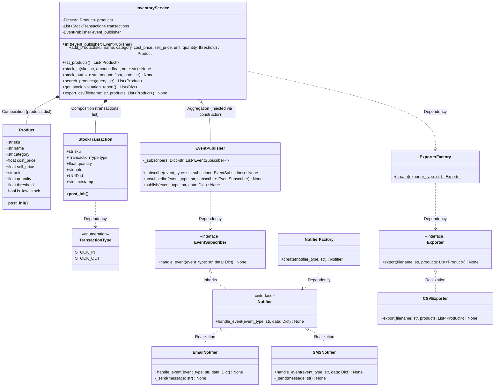

# Class Diagram (Inventory System)

```mermaid
classDiagram
    %% --- Models ---
    class TransactionType {
        <<enumeration>>
        STOCK_IN
        STOCK_OUT
    }
    
    class Product {
        +str sku
        +str name
        +str category
        +float cost_price
        +float sell_price
        +str unit
        +float quantity
        +float threshold
        +bool is_low_stock
        +__post_init__()
    }

    class StockTransaction {
        +str sku
        +TransactionType type
        +float quantity
        +str note
        +UUID id
        +str timestamp
        +__post_init__()
    }
    
    %% --- Events (Observer Pattern) ---
    class EventSubscriber {
        <<interface>>
        +handle_event(event_type: str, data: Dict) None
    }
    
    class EventPublisher {
        -_subscribers: Dict~str, List~EventSubscriber~~
        +subscribe(event_type: str, subscriber: EventSubscriber) None
        +unsubscribe(event_type: str, subscriber: EventSubscriber) None
        +publish(event_type: str, data: Dict) None
    }
    
    %% --- Notifiers ---
    class Notifier {
        <<interface>>
        +handle_event(event_type: str, data: Dict) None
    }
    
    class EmailNotifier {
        +handle_event(event_type: str, data: Dict) None
        -_send(message: str) None
    }
    
    class SMSNotifier {
        +handle_event(event_type: str, data: Dict) None
        -_send(message: str) None
    }
    
    class NotifierFactory {
        +create(notifier_type: str)$ Notifier
    }
    
    %% --- Exporters (Factory Pattern) ---
    class Exporter {
        <<interface>>
        +export(filename: str, products: List~Product~) None
    }
    
    class CSVExporter {
        +export(filename: str, products: List~Product~) None
    }
    
    class ExporterFactory {
        +create(exporter_type: str)$ Exporter
    }
    
    %% --- Service ---
    class InventoryService {
        -Dict~str, Product~ products
        -List~StockTransaction~ transactions
        -EventPublisher event_publisher
        +__init__(event_publisher: EventPublisher)
        +add_product(sku, name, category, cost_price, sell_price, unit, quantity, threshold) Product
        +list_products() List~Product~
        +stock_in(sku: str, amount: float, note: str) None
        +stock_out(sku: str, amount: float, note: str) None
        +search_products(query: str) List~Product~
        +get_stock_valuation_report() List~Dict~
        +export_csv(filename: str, products: List~Product~) None
    }
    
    %% --- Relationships ---
    
    %% Implementations
    Notifier <|.. EmailNotifier : Realization
    Notifier <|.. SMSNotifier : Realization
    EventSubscriber <|.. Notifier : Inherits
    Exporter <|.. CSVExporter : Realization
    
    %% Dependencies
    NotifierFactory ..> Notifier : Dependency
    ExporterFactory ..> Exporter : Dependency
    StockTransaction ..> TransactionType : Dependency
    InventoryService ..> ExporterFactory : Dependency
    EventPublisher ..> EventSubscriber : Dependency
    
    %% Composition / Aggregation
    InventoryService *-- Product : Composition (products dict)
    InventoryService *-- StockTransaction : Composition (transactions list)
    InventoryService o-- EventPublisher : Aggregation (injected via constructor)
```
