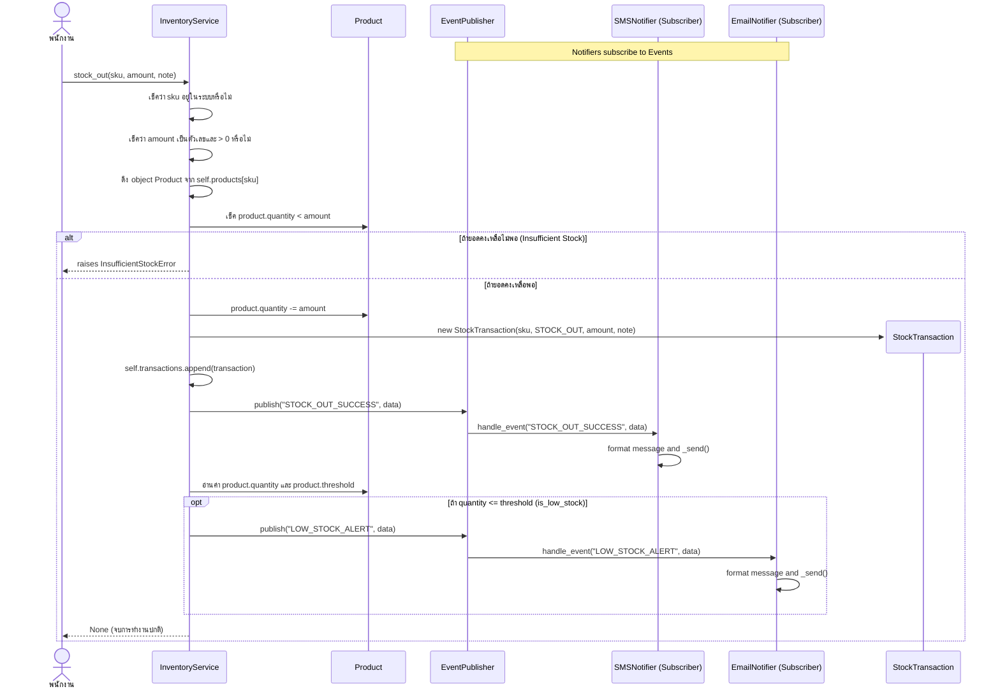

# Sequence Diagram (Stock Out with EventPublisher)

```mermaid
sequenceDiagram
    actor Employee as พนักงาน
    participant IS as InventoryService
    participant P as Product
    participant EP as EventPublisher
    participant SMS as SMSNotifier (Subscriber)
    participant Email as EmailNotifier (Subscriber)

    %% Initial Setup (happens during app initialization)
    Note over EP,Email: Notifiers subscribe to Events
    %% EP->>SMS: subscribed to STOCK_OUT_SUCCESS
    %% EP->>Email: subscribed to LOW_STOCK_ALERT

    Employee->>IS: stock_out(sku, amount, note)
    
    %% Validation
    IS->>IS: เช็คว่า sku อยู่ในระบบหรือไม่
    IS->>IS: เช็คว่า amount เป็นตัวเลขและ > 0 หรือไม่
    IS->>IS: ดึง object Product จาก self.products[sku]
    
    IS->>P: เช็ค product.quantity < amount
    alt ถ้ายอดคงเหลือไม่พอ (Insufficient Stock)
        IS-->>Employee: raises InsufficientStockError
    else ถ้ายอดคงเหลือพอ
        %% Deduct stock
        IS->>P: product.quantity -= amount
        
        %% Create transaction record
        create participant ST as StockTransaction
        IS->>ST: new StockTransaction(sku, STOCK_OUT, amount, note)
        IS->>IS: self.transactions.append(transaction)
        
        %% Publish Event for SMS Notification (Always)
        IS->>EP: publish("STOCK_OUT_SUCCESS", data)
        EP->>SMS: handle_event("STOCK_OUT_SUCCESS", data)
        SMS->>SMS: format message and _send()
        
        %% Check threshold for low stock alert
        IS->>P: อ่านค่า product.quantity และ product.threshold
        opt ถ้า quantity <= threshold (is_low_stock)
            IS->>EP: publish("LOW_STOCK_ALERT", data)
            EP->>Email: handle_event("LOW_STOCK_ALERT", data)
            Email->>Email: format message and _send()
        end
        
        IS-->>Employee: None (จบการทำงานปกติ)
    end
```
